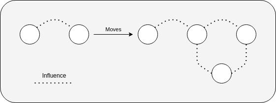
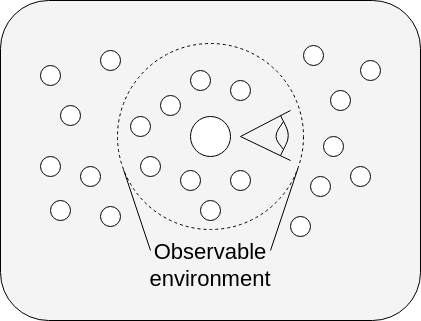

# Simplistic step-by-step

The simulation of [question 17: "Dépistons ! Oui mais qui, quand et comment ?"](https://covprehension.org/2020/05/12/q17.html) from the website [CoVprehension.org](https://covprehension.org/) was chosen as basis for the following simulations. Its agents have five possible health states of which three are kept and two are added: susceptible, infected (i.e. symptomatic), recovered, hospitalised and deceased. Susceptible agents can get infected. Infected agents can infect susceptible agents, recover from their infection over time by becoming recovered agents or get hospitalised as the infection worsens. Hospitalised agents can either become recovered agents or deceased agents. The deceased and recovered states are both considered as final states for the first simulations. The latter gives full immunity to agents against the virus. The simulation ends once no more agents are in the infected or hospitalised state.

_S: Susceptible; I: Infected; H: Hospitalised; R: Recovered; D: Deceased_

## 1. Vaccine efficiency

Agents are given an additional parameter showing their vaccinated state, which is different from a health state. Either they are vaccinated, or they're not. The vaccinated parameter plays a role in the probability for agents to get infected, in the time it takes them to recover from their infection and by influencing the chances they have to not get hospitalised, nor die. In other words, a good vaccine makes vaccinated agents have fewer chances to get infected by other agents, it makes them recover faster from their infected state and it should prevent them from getting hospitalised.

The simulated vaccine has five adjustable parameters, all controlling the probability for a vaccinated agent of any state to get to the next state.

### 1.1 Static

>Given a vaccine effectiveness and a fixed percentage of vaccinated agents in a population, how does it affect the spread of the virus in that population?

The static version of this simulation requires the user to give a fixed percentage of vaccinated agents among the population before the start of the simulation. Varying this percentage should, depending on the vaccine's effectiveness, expose a turning point at which a percentage of vaccinated agents is sufficient to totally limit the spread of the virus, thus enabling group immunity. Results of this simulation are viewed in a graph showing the number of infected agents and the number of recovered agents across time.

### 1.2 Dynamic

>Given a vaccine effectiveness and a rate at which to vaccinate a percentage of the population, how does it affect the spread of the virus in that population?

The dynamic version of this simulation enables the user to give a rate at which a given percentage of agents will get vaccinated. Results of this simulation are viewed in a graph showing the number of infected agents, the number of recovered agents and the number of vaccinated agents across time.

## 2. Public trust

The following simulations add a normalised trust parameter to agents. This parameter is used as a probability for agents to get vaccinated. Agents with a higher trust level have a higher chance "to want" to get vaccinated, while agents with a lower trust level have a smaller chance to be inclined to.

### 2.1 Static

>Given a fixed level of trust for all agents, a vaccine effectiveness and a rate at which to vaccinate a percentage of the population, how does it affect the spread of the virus in that population?

The static version of this simulation makes use of a given fixed level of trust that all agents will carry. Varying the level of trust should demonstrate how trust has a crucial role in order to contain the spread of the virus through vaccination. Results of this simulation are viewed in a graph showing the number of infected agents, the number of recovered agents and the number of vaccinated agents across time.

### 2.2 Dynamic - Contact influence

>Given an average trust level shared amongst agents, a vaccine effectiveness and a rate at which to vaccinate a percentage of the population, how does it affect the spread of the virus in that population?

The dynamic version of this simulation, with contact influence, gives the user the possibility to give an average initial trust level shared throughout the population. Agents in contact with each other will influence themselves into adjusting their trust level towards the one of their acquaintance. This adjustment depends on the degree of polarisation of their trust level. Two highly polarised agents with opposite trust levels coming into contact will barely influence themselves, while an agent with a highly polarised trust level will have more influence on an agent with a moderately polarised trust level. Results of this simulation are viewed in a graph showing the number of infected agents, the number of recovered agents, the number of vaccinated agents and the average trust level of the population across time.

### 2.3 Dynamic - Observation influence

Agents will now base themselves on their surroundings to update their level of trust. This makes the asymptomatic state a crucial element to add to this simulation. An agent surrounded by vaccinated and asymptomatic agents will think that the vaccine is efficient, while an agent surrounded by unvaccinated and asymptomatic agents will think that the vaccine is useless.

_S: Susceptible; I: Infected symptomatic; A: Infected asymptomatic; H: Hospitalised; R: Recovered; D: Deceased_

>Given an average trust level shared amongst agents, a vaccine effectiveness and a rate at which to vaccinate a percentage of the population, how does it affect the spread of the virus in that population?

The dynamic version of this simulation, with coherence influence, requires the user to give an average initial trust level shared throughout the population. Results of this simulation are viewed in a graph showing the number of infected agents, the number of recovered agents, the number of vaccinated agents and the average trust level of the population across time.

## 3. Limited natural immunity

Immunity to diseases usually decrease over time. Implementing this in the simulation implies the recovered state not being a final state anymore, thus no longer giving agents full immunity to the virus. Simply put, recovered agents will become susceptible to infections again.

The simulated vaccine now has an additional adjustable parameter controlling the threshold at which a vaccinated agent in the recovered state will get to the susceptible state.

_S: Susceptible; I: Infected symptomatic; A: Infected asymptomatic; H: Hospitalised; R: Recovered; D: Deceased_

>Given a natural immunity period, a vaccine effectiveness and a rate at which to vaccinate a percentage of the population, how does it affect the spread of the virus in that population?

This simulation needs the user to specify a period during which agents will have a natural immunity against the virus. Results of this simulation are viewed in a graph showing the number of infected agents, the number of recovered agents and the number of vaccinated agents across time.

## 4. Limited vaccine immunity

Vaccine immunity also decreases over time and can be of a different level of effectiveness than natural immunity. Implementation of the vaccine's immunity period makes agents lose their vaccinated parameter and makes them susceptible to becoming infected and hospitalised as a non-vaccinated agent.

>Given a vaccine immunity period, a natural immunity period and a rate at which to vaccinate a percentage of the population, how does it affect the spread of the virus in that population?

This simulation allows the user to give a period during which agents will have an artificial immunity against the virus. Results of this simulation are viewed in a graph showing the number of infected agents, the number of recovered agents and the number of vaccinated agents across time.

## 5. Vaccine boosters

Decreasing immunity is a health risk that makes vaccines ineffective in the long run. In order for agents to keep on protecting themselves from getting long infections and potentially hospitalised, vaccine boosters are added to the simulation. In the simulation, this makes it possible for susceptible agents previously immunised through vaccination or infection to get vaccinated and gain immunity again.

>Given a vaccine immunity period, a natural immunity period and a rate at which to vaccinate a percentage of the population, how does it affect the spread of the virus in that population?

Results of this simulation are viewed in a graph showing the number of infected agents, the number of recovered agents and the number of vaccinated agents across time.
